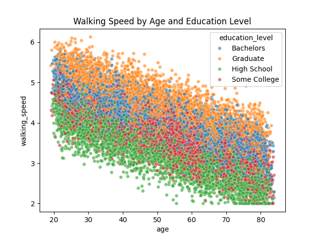
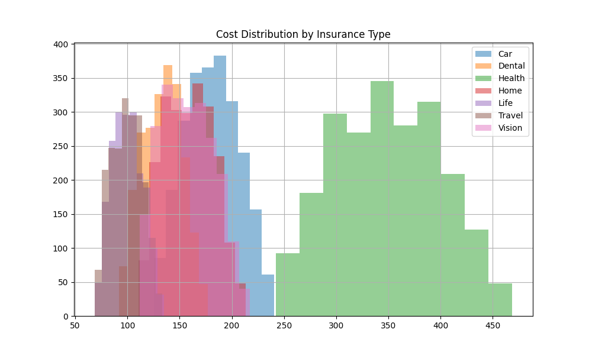

[](https://classroom.github.com/open-in-codespaces?assignment_repo_id=16988424)

# Final Project: Insurance Visits Dataset

## Question 1. Data Preparation with Command-Line

prepare.sh - takes in the ms_data_dirty.csv file and outputs a cleaned ms_data.csv that removed all random spacing, commas, and comments. 

## Question 2: Data Analysis with Python

analyze_visits.py - processes the ms_data.csv file and corrects the variable types to be quantitative or categorical. Instead of the basic, premium, and platinum options, I have created different insurance plans for different categories: Health, Dental, Vision, Home, Car, Travel, Life. Visit costs were generated unique to an individual and started at a base cost by the insurance type, then modified with random variation along with age considered. The summary of average costs by insurance type is as shown:

```plaintext
Mean visit costs by insurance type:  insurance_type
Car       209.115909
Dental    233.950043
Health    350.497009
Home      239.099526
Life       99.615982
Travel     65.870282
Vision    158.428623
```

## Question 3: Statistical Analysis

stats_analysis.py - data analysis and model diagnosis

### Walking Speed Analysis

Prior to analysis, basic checks were done on the variables. The IQR rule was used to get rid of existing outliers present in walking speed. A linaer mixed effects model, which accounts for repeated visits for the same patient, was chosen to assess the relationship between education, age, and walking speed. The significance of the variables and their confidence intervals are shown:

```plaintext
 ----------------------------------------------------------------------------
                                 Coef.  Std.Err.    z     P>|z| [0.025 0.975]
 ----------------------------------------------------------------------------
 Intercept                        5.603    0.011  497.434 0.000  5.581  5.625
 education_level[T.Graduate]      0.402    0.009   45.546 0.000  0.385  0.419
 education_level[T.High School]  -0.788    0.009  -92.005 0.000 -0.805 -0.772
 education_level[T.Some College] -0.406    0.009  -46.868 0.000 -0.423 -0.389
 age                             -0.030    0.000 -166.796 0.000 -0.030 -0.030
```

We observe that all the coefficients are statistically significant with narrow confidence interval ranges. Specifically, walking speed seems to decrease as age increases or if a patient is in high school or some college; it seems to increase if the patient is in graduate school, controlling for all other factors.

To assess the trends between age and walking speed, we observe the relationship using scatterplot:



We observe age and walking speed have an overall negative correlation and are clearly defined by education levels, with lower levels walking slower on average and higher levels walking faster on average.

To test whether the effect of education is significant. We compare a simple linear regression model with age as the sole predictor, compared to age + education as the predictors. We calculate a likehood ratio test statistic (LRT) of 3235.32 and a p-value of 0.0, indicating that the full model (linear mixed effects with both age and education) indeed provides better performance.

### Cost Analysis

Next, we visualize visit cost trends first by insurance type:

 

We observe that most insurances and normally distributed around the same range except health, which has a higher and wider range. To determine the insurance type effect, we perform a one-way ANOVA test to compare each type of insurance. From the test output, we observe an F-statistic of 21017.93 and a p-value of around 0, indicating the costs are statistically difference across insurance types. The resulting effect size (eta^2 value) measures around 0.89, demonstrating high proportion of variance in the data is explained by the model.

### Age and Education Interaction

We are interested to see if there is an interaction between age and education in predicting walking speed. We fit a linear model using generalized least squares with this interaction with the following output:

```plaintext
=========================================================================================
                            coef    std err          t      P>|t|      [0.025      0.975]
-----------------------------------------------------------------------------------------
Intercept                 5.7907      0.021    280.194      0.000       5.750       5.831
education_numeric        -0.2627      0.011    -23.668      0.000      -0.284      -0.241
age                      -0.0310      0.000    -82.654      0.000      -0.032      -0.030
education_numeric:age     0.0005      0.000      2.463      0.014       0.000       0.001
```

The R^2 is 0.595, which is the proportion explained by the  model. The interaction between education and age is not sigficiant, as demonstrated from the high p-value and a coefficient of around 0. Thus, interaction between education and age is scarce and presents no issues in the full model. 

We also went ahead and tested if insurance could be a potential confounder and added it to the model; however, the coefficients for age and education were around the same for the crude output in the original model and for the newly fitted one. Thus, insurance does not present any confounding effect on age or education.

We choose the original mixed effects model as the best one.

## Question 4: Data Visualization

visualize.ipynb - visualizations

For visualizations, walking speed and visit costs were analyzed in relation to effects of education and insurance types.

1. From our previous analysis and these visualizations, we confirm that age and walking speed have a negative relationship from the regression plot.
2. Walking speed is highest for graduate students and lowest for high school students, and this is consistent across ages
3. Health insurance has the highest average visit costs, whereas traevel has the lowest
4. From the pairs plot, visit costs seem to increase by age. 
5. The walking speed seems ot be uniform across all insurance types
6. From the time trend, visits costs averages seem to increase slightly over time

